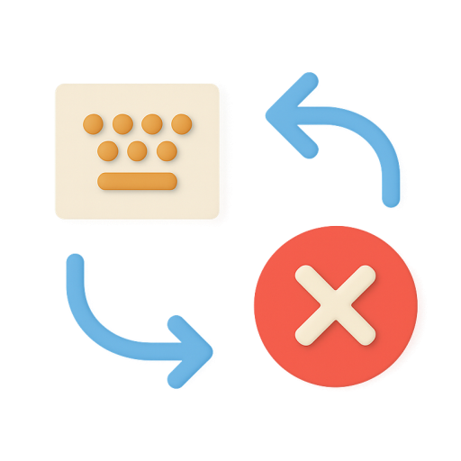

  

# Keyboard Layout Switcher

VS Code extension to quickly switch the keyboard layout of selected text between supported language pairs. Useful for correcting text typed in the wrong layout (e.g., Russian instead of English, or vice versa).

---

## Features

- **Two-way keyboard layout conversion** for selected text.
- Supports multiple language pairs:
  - Russian (ЙЦУКЕН) ↔ English (QWERTY)
  - Ukrainian (ІЇЄ) ↔ English (QWERTY)
  - German (QWERTZ) ↔ English (QWERTY)
- Detects the direction of conversion automatically based on the selected text.
- Command available via Command Palette and context menu (when text is selected).
- Configurable active layout pair via extension settings.

---

## How to Use

1. **Select** the text typed in the wrong keyboard layout.
2. Perform one of the following actions:
   - Open the **Command Palette** (`Ctrl+Shift+P` on Windows/Linux, `Cmd+Shift+P` on Mac), type and select the `Switch Layout` command;
   - Use the **editor context menu**: right-click the selected text and choose `Switch Layout`;
   - Hover over the selected text to reveal the **floating menu** (hover) — a tooltip with the `Switch Layout` button will appear.
3. The selected text will be converted to the corresponding layout according to the active layout pair in the settings.

> **Notes:**
> - The command works only when text is selected.
> - The conversion direction (to or from) is determined automatically based on the content of the selected text.

---

## Extension Settings

You can configure the active keyboard layout pair for conversion:

- Open **Settings** (`Ctrl+,` or `Cmd+,`).
- Search for `Keyboard Layout Switcher`.
- Change the **Active Layout** (`kb-layout-switcher.activeLayout`) to one of:
  - `ru-en` — Russian (ЙЦУКЕН) ↔ English (QWERTY)
  - `ua-en` — Ukrainian (ІЇЄ) ↔ English (QWERTY)
  - `de-qwertz` — German (QWERTZ) ↔ English (QWERTY)

---

## Supported Language Pairs

| Layout Key  | First Language | Second Language | Description                       |
|-------------|:-------------:|:--------------:|-----------------------------------|
| ru-en       |   Russian     |    English     | ЙЦУКЕН ↔ QWERTY                   |
| ua-en       |  Ukrainian    |    English     | ІЇЄ ↔ QWERTY                      |
| de-qwertz   |   German      |    English     | QWERTZ ↔ QWERTY                   |

---

## Requirements

- Visual Studio Code **1.75.0** or higher

---

## Known Issues

- Only the selected text is converted. The extension does not change the keyboard layout globally.
- Some special characters may not be mapped in all layouts.

---

## Contributing

Pull requests and suggestions are welcome! Please open an issue to discuss your idea or bug before submitting a PR.

---

## License

[MIT](LICENSE.md)
